# 在线代码测评系统

### 开发环境

- Java版本：Jdk 17

- 数据库：MySQL 8.0、Redis 6.2.6

- 开发工具 ：IntelliJ IDEA、Maven 3.8.6

### 采用技术
- Spring Boot、MyBatis-Plus、redis
- vue3、Axios、Element Plus

### 部署运行环境

- Centos7

### 系统架构设计

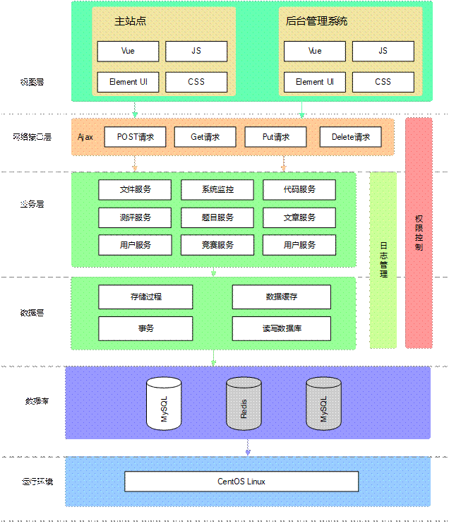

​		视图层包括网站主站点和后台管理系统，主站点负责向用户提供服务，是用户看到的系统页面。用户可以在上面进行登录注册、个人信息管理、查看题目、编写代码、提交代码、查看测评状态、查看排名、参加竞赛、查看竞赛结果以及发布文章等主要操作。后台管理系统是专门给系统管理员使用的管理后台，管理员可以在上面进行用户管理、题目管理、竞赛管理、日志管理以及查看系统运行状态等操作。视图层通过Axios与后端接口进行数据交互。

​		网络接口层的主要职责是接收用户的请求，根据请求参数的不同，做出不同的响应，响应数据的格式是JSON数据。

​		业务层包括用户服务、题目服务、竞赛服务、代码服务、测评服务、文件服务、文章服务等功能模块。业务层主要是实现系统功能的代码部分，通过数据映射实现和数据层的交互，从而实现数据的持久化。

​		数据层是系统最底层，也是最重要的一层，系统中所有的数据均保存在数据层的MySQL服务和Redis服务中。

### 系统总体设计

​		本系统主要分为用户和管理员两个主要的模块。用户模块主要包括登录注册、个人中心、题目浏览、代码评测、竞赛参与、文章发布等多个子功能模块。管理员的功能模块包括用户管理、题目管理、测评管理、竞赛管理、文章管理等。本系统详细的功能模块划分图如图所示。

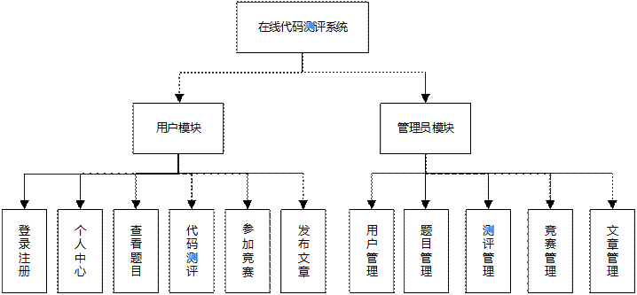

#### 代码测评流程图

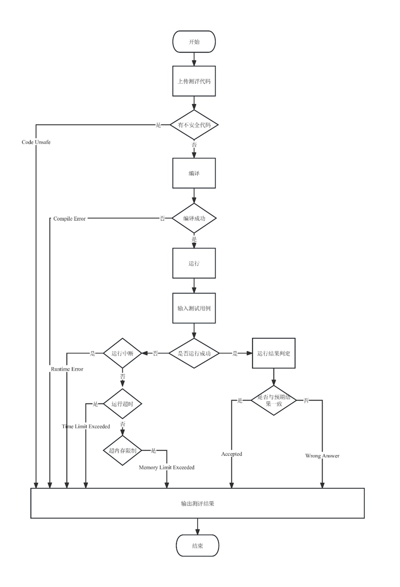

测评结果设计：

Compile Error：编译错误。用户提交的代码中有语法错误，无法通过编译器检查。

Partial Accepted：部分测评用例通过。表面用户提交的源代码可以通过部分测评用例，还有一部分测评用例无法通过，需要用户考虑其他的可能性。

Accepted：通过。用户提交的源代码经过测试后通过了所有的测评用例，表面用户解决了该题目。

Wrong Answer：答案错误。表示用户提交的源代码的输出结果错误，没有通过任何一个测评用例。

Runtime Error：运行时错误。程序在运行时异常终止，可能的原因有段错误、除0、栈溢出或数组越界等多种错误。

Time Limit Exceeded：超时。用户提交的源代码在测试运行时超出了题目设定的最大运行时间限制，不符合题目的要求。

Memory Limit Exceeded：内存超限。程序在运行时使用的内存空间超出题目设定的内存限制。

System Error：系统错误。在进行代码测评时，测评机器发送错误，这个错误与系统相关。

#### 编译器设置

| 名称       | 版本             | 编译命令                                    |
| ---------- | ---------------- | ------------------------------------------- |
| C          | GCC  4.8.5       | /usr/bin/gcc  {src_path} -o {exe_path}      |
| C++        | G++  4.8.5       | /usr/bin/g++  {src_path} -o {exe_path}      |
| Java       | JDK  17.0.6      | /usr/bin/javac  {src_path} -d {exe_path}    |
| Python     | Python  3.6.8    | /usr/bin/python3  {src_path}                |
| Golang     | Golang  1.20.2   | /usr/bin/go  build -o {exe_path} {src_path} |
| JavaScript | Node.js  16.19.1 | /usr/bin/node  {src_path}                   |

### 主要功能实现

(一) 用户模块

1) 登录注册

注册和登录是系统中其他功能的使用前提，进入注册页面后，用户需要输入用户名、电子邮箱、邮箱验证码、密码和确认密码，只有邮箱验证码和Redis缓存中保存的一致、邮箱未注册、两次输入的密码一致，用户才能注册成功。系统注册页面如图4.1所示。

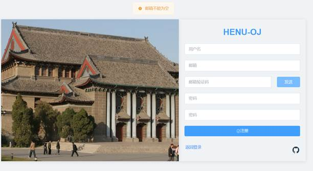

###### 图4.1 用户注册页面

2) 个人中心

个人中心主要用于向用户展示自己的个人信息。同时用户还可以进行个人资料的编辑和重置密码等操作。如图所示是系统个人中心页面。

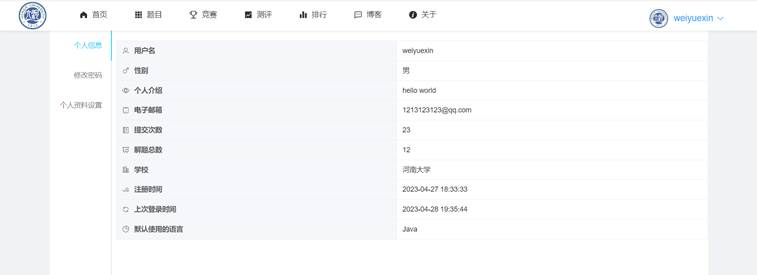

3) 查看题目

用户可以在题目列表可以分页查看题目列表，包括题目名称、难度、提交次数、通过率等等信息。题目详情页可以查看题目详细信息和进行代码提交。如图4.3为题目列表页，图为题目详情页。

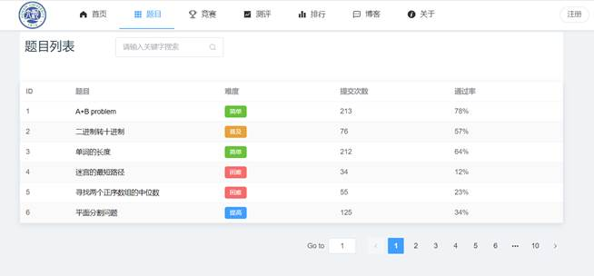

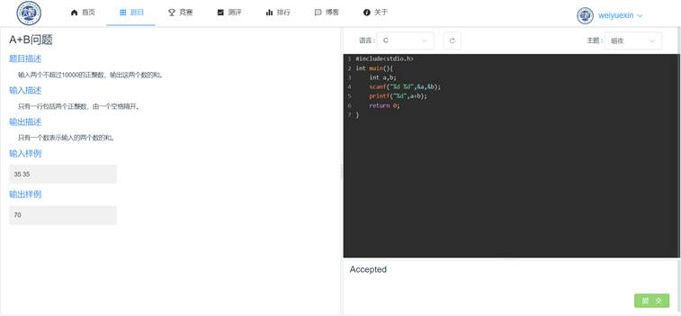

4) 代码测评

代码测评在使用后在如上图4.4页面提交代码后进行的。代码测评的流程如下：

1. 用户提交代码；
2. 进行代码安全性检查，检查是否有危害系统运行的代码输入；
3. 编译代码（不需要编译的语言没有这一步）；
4. 逐一运行测评用例，判断输出结果是否和正确结果一致；
5. 所有测试用例运行完成后，将结果返回给用户。

5) 发布文章

发布文章页面中用户需要填写标题、分类、正文等内容。发布文章页面如图所示。

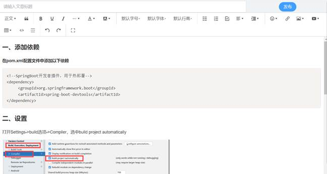

(二) 管理员模块

1) 用户管理

管理员可以对系统中的注册用户进行管理。用户管理页面如图所示。

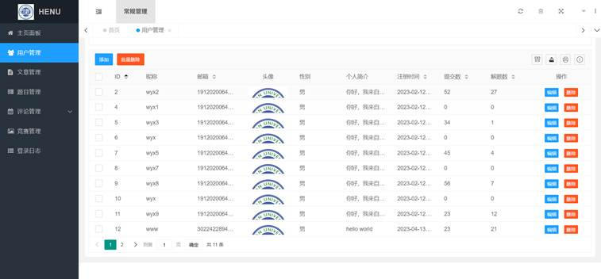

2) 题目管理

管理员可以对当前系统中的题目进行管理。题目管理页面如图所示。

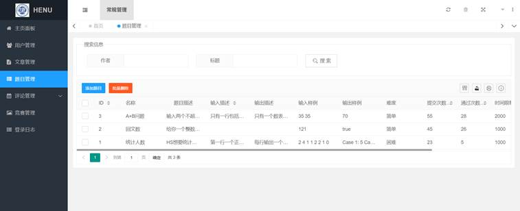

3) 测评管理

管理员进入测评管理模块后，可以查看题目测评记录。当然这些测评记录都是用户提交代码进行测评时生成的。测评管理页面如图所示。

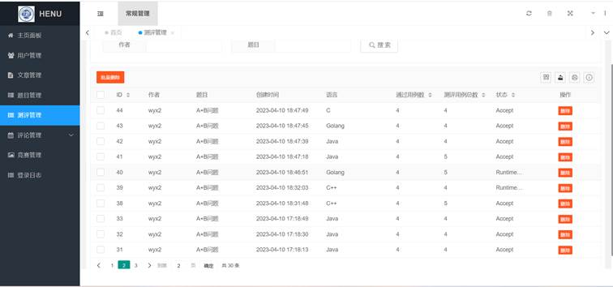

4) 竞赛管理

管理员是系统中唯一可以对竞赛进行管理的角色。竞赛管理包括查看、创建和删除等操作。创建竞赛时需要设定竞赛的开始和结束时间。竞赛管理页面如图所示。

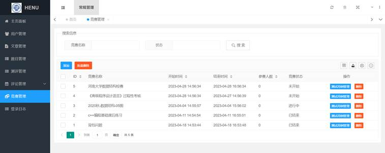

5) 文章管理

管理员可以对文章进行管理。实现了查看文章列表、删除文章等功能。文章管理页面如图所示。

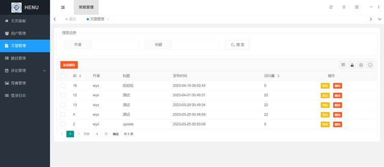

